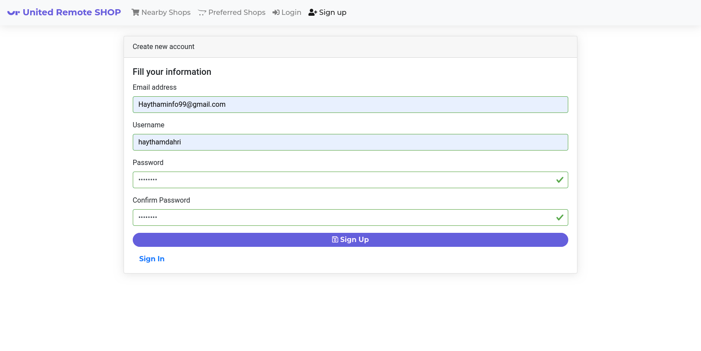
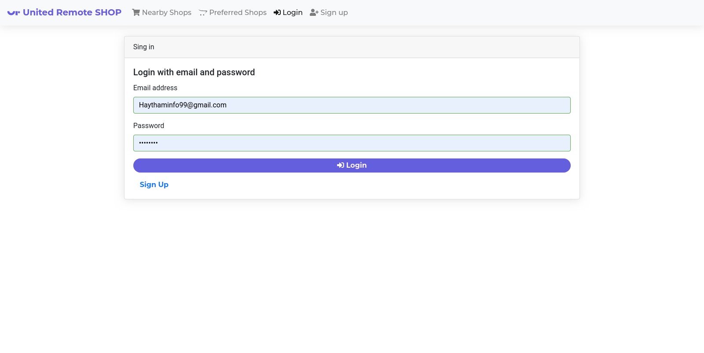
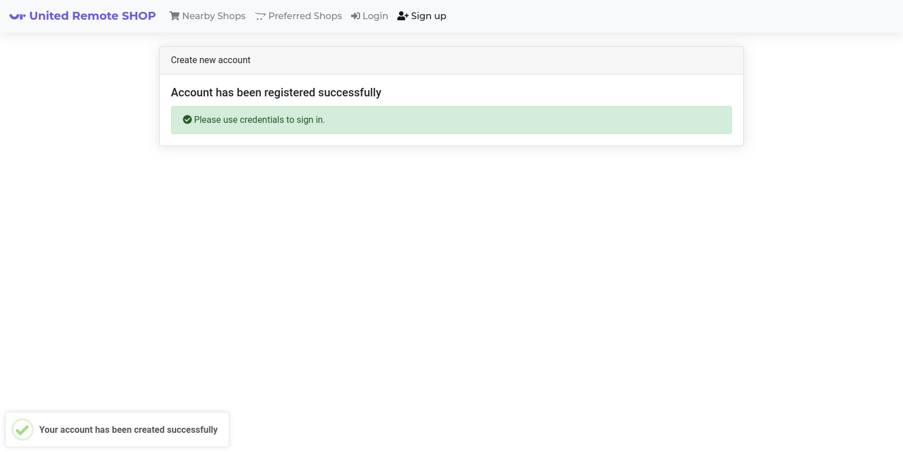
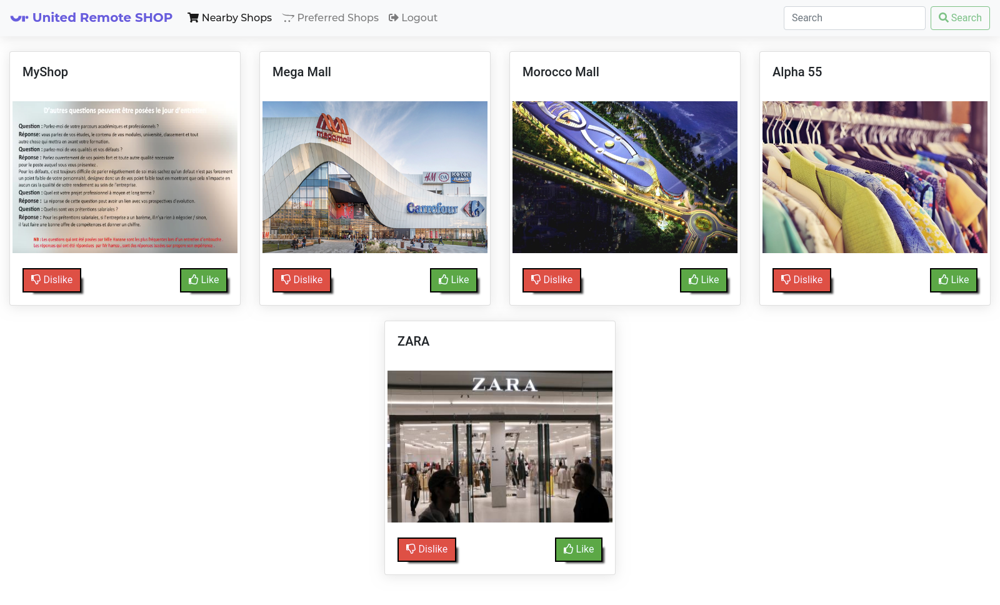
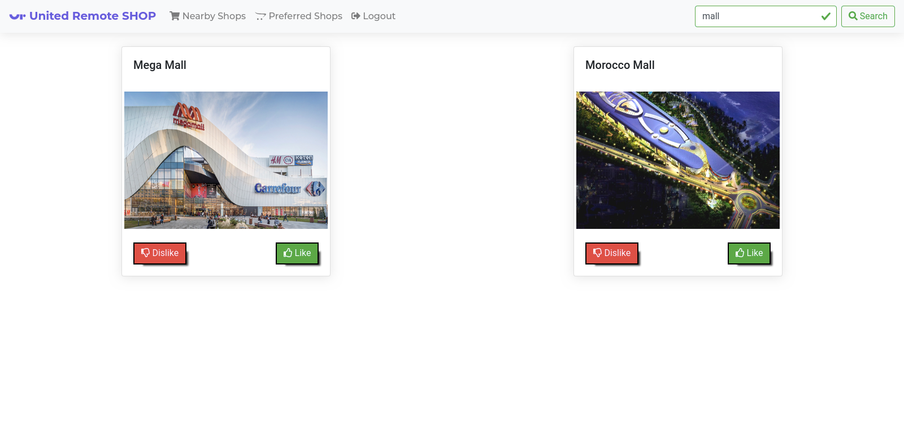
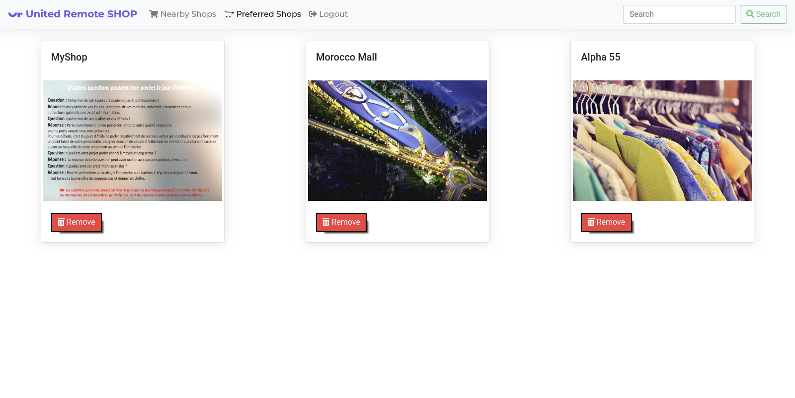

# Shop Front-end Side Application

Shop is a full-stack application released with [Spring Boot Framework](https://spring.io/projects/spring-boot) in the back-end server side and [Angular Framework](https://angular.io/) in the web front-end client side.
The objective behind this project is creating a front-end application to consume the released [back-end api](https://github.com/haythamdahri/full-stack-coding-challenge-back-end).
In this project, we are using Angular Framework to build a **Single Page Application(SPA)** to consume the back-end api in order to satisfy all mentionned requirements which was written earlier in the **[Web Coding Challenge](https://github.com/hiddenfounders/web-coding-challenge/blob/master/README.md)**.

## Getting Started
To use the project, we mainly need to install necessary dependencies written in **package.json** file.

## Prerequisites
In order to ensure the application run process, we need a mandatory prerequisite to be installed either in the system.

[NodeJs:](https://nodejs.org/) Node.js® is a JavaScript runtime built on Chrome's V8 JavaScript engine. 

## Setting up front-end client application
To set-up the project, we need to install **node modules(preferred locally)** using **npm tool (Network Package Manager)** by running the following command
```bash
npm install --save
```
After completing the previous step, we can start the server to run the front-end application using **ng (Angular Command Line)** as follows:
```bash
ng serve
```
After compiling and generating the bundle, the application must be accessible from **[http://localhost:4200](http://localhost:4200)**

## Application Features and functionalities
The objective here to set-up a successful connection between the [Front-end Client Side Application](https://github.com/haythamdahri/full-stack-coding-challenge-front-end) and the [Back-end Server Side Application](https://github.com/haythamdahri/full-stack-coding-challenge-back-end).
As already mentioned in the [Web Challenge Specification](https://github.com/hiddenfounders/web-coding-challenge/blob/master/coding-challenge.md), we will introduce all web pages and scenarios that are expected from the application to produce.


- **Sign up:** 
  - As a User, I can sign up using my email & password :heavy_check_mark:



- **Login:** 
  - As a User, I can sign in using my email & password :heavy_check_mark:


  - Successfully signed up user :heavy_check_mark:



- **Main Page:** 
  - As a User, I can display the list of shops sorted by distance :heavy_check_mark:



  - As a User, I can like a shop, so it can be added to my preferred shops :heavy_check_mark:
  - Liked shops shouldn’t be displayed on the main page :heavy_check_mark:
  - As a User, I can dislike a shop, so it won’t be displayed within “Nearby Shops” list during the next 2 hours :heavy_check_mark:
  - As a User, i can perform searchs for shops by name :heavy_check_mark:



- **My Preferred Shops:** 
  - As a User, I can display the list of preferred shops :heavy_check_mark:
  - As a User, I can remove a shop from my preferred shops list :heavy_check_mark:



At this point, we have successfully implement the Front-end Client side application by consuming the Back-end Server Side application using JWT authentication where we retrieve the Token from the server, save it locally and send it for each request to pass the authentication and authorization check successfully. 

## Contributing
Pull requests are welcome. For major changes, please open an issue first to discuss what you would like to change.

## Author
 - HAYTHAM DAHRI

**[Linkedin](https://www.linkedin.com/in/haytham-dahri/)** - **[Github](https://github.com/haythamdahri)** - **[Facebook](https://www.facebook.com/Haytham.dahri)**

***
Thank you for taking time to read the documentation. :+1: